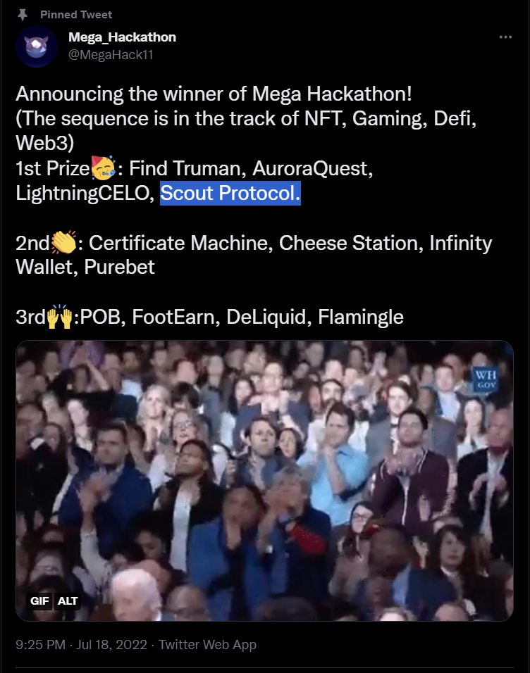
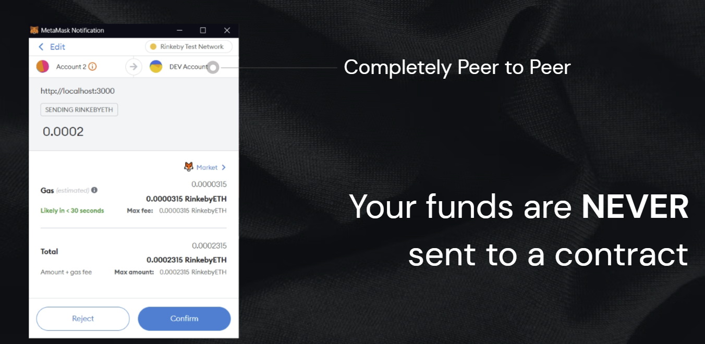
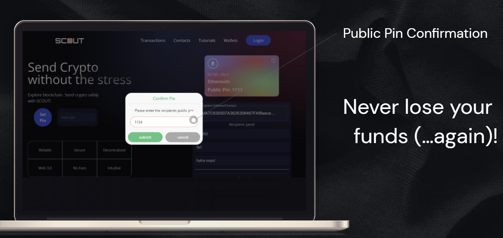
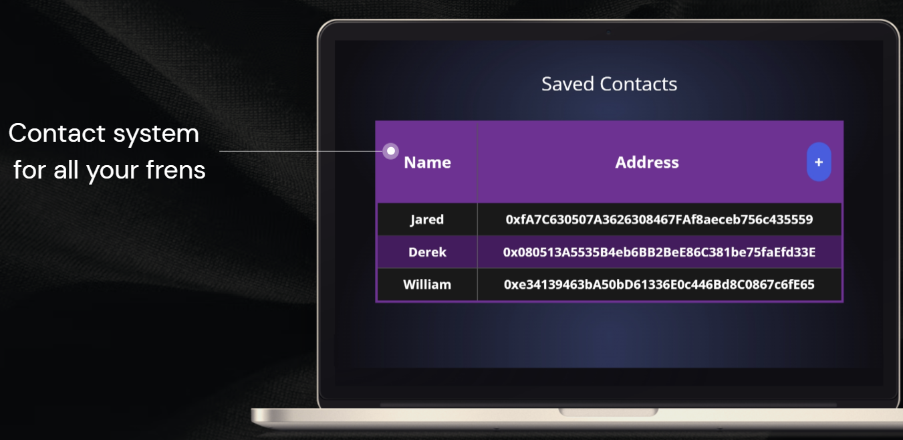
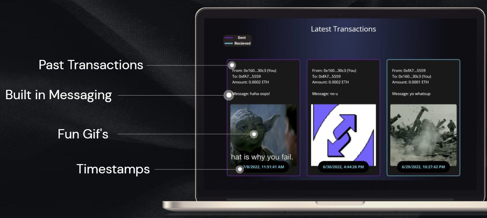
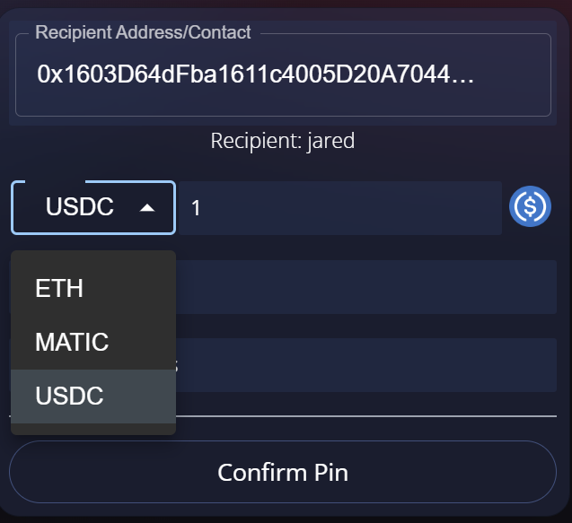
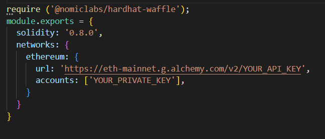

# Scout-Protocol-Mainnet
https://scoutprotocol.xyz
A tool made to improve the experience of transferring crypto...

A Live Tutorial: https://www.youtube.com/watch?v=LXI-PWkZR4k

## Overview

Scout is a first of its kind intuitive, decentralized platform to improve the experience of transferring cryptocurrency. Scout is completely peer-to-peer meaning Scout never holds custody of user's coins. Anyone can connect to and use Scout without ever having to hand over control of their funds.

Scout has a suite of built in features to improve transparency and security when sending funds. This includes a novel public key system where users can set a pin as a second form of verification for other user wanting to send crypto to them. This ensures that funds always get to their intended recipients! Scout also provides an in-built contact system, as well as messaging and gifs on the blockchain! 

All optional of course for the anons out there ;) 

<b>And...no kyc/personal information required or collected!<b>

## Awards
[Scout won 1st place](https://mirror.xyz/m7e.eth/AQSfetsbmfznywv5OgJoq9rOEeqp3HybQWoVaA3f-gc) in the first ever [MEGA Hackathon](https://www.megahackathon.com/#Feature6_0) sponsored by Polygon and Solana!



MEGA hackathon was the first ever student-run blockchain hackathon and was put on by top tier Universities including Northwestern, USC, and UChicago. MEGA hackathon also partnered with blockchain groups all across the world including the Oxford Blockchain Society, Carnegie Mellon Blockchain Group, and Georgia Tech Blockchain group.


## Feature Overview

* Entirely peer-to-peer
  * Scout's contract NEVER has control of user's coins

    

* Pin security
  * Public pin confirmation system provides a check that you entered your intended destination

    
  
* Contact system
  * Automatically autofill addresses of common contacts

    
  
 * Built in messaging, gifs, and timestamps

    
  
 * Supports ETH, MATIC, and USDC and is compatible with ALL erc20 tokens and EVM chains

    
  
 * Integrates seamlessly with metamask
 * Free to use!!!


## Getting started (for devs)
1. Fork repo
2. Make sure to install [Vite](https://vitejs.dev/) and [Hardhat](https://hardhat.org/)
3. Run ```npm run build``` to build the optimized folder that can be deployed to any website hosting platform

### Key files
  - The ```client``` folder is written in React and contains all the frontend code for the site. Client is also responsible for interacting with the data stored by the smart contract
    - ```client/src/components``` holds the components of the frontend
    - ```client/src/utils``` holds contract ABI's, contract addresses, json files and other useful constants

  -  The ```smart_contract``` folder contains a contract written in solidity as well as a deployment script and config file


### Running locally
1. Change into the client directory
2. Run the following command (this will only work if you have vite installed)
    ```npm run dev```
3. View http://localhost:3000/ in your browser

### Deployment to a network

1. In the hardhat config file enter your alchemy api key and private key from your wallet (DO NOT PUBLISH THIS TO GITHUB!!!). If you are deploying to a different network make sure to change the network name to the desired chain (ie goerli, rinkeby, etc).



2. Change directories into ```smart_contract``` 

3. Run the following command (replacing desired_network with your network of choice)

  ```npx hardhat run scripts/deploy.js --network [DESIRED_NETWORK]```


### Add additional ERC20 tokens
Additional erc20 tokens can be added through the following process...

  1. Find the address of the token on the desired network. I highly reccomend using [Uniswap's token lists](https://tokenlists.org/) to find the official addresses
  2. Copy the contract address and contract ABI of the ERC20 contract from etherscan (add into the utils folder)
  3. In the frontend make a function to create a contract utilizing the contract address and ABI from part 2 (see ```createUsdcContract()``` in Welcome.jsx as an example)
  4. Make a function to call the contract's transfer function (see ```sendUSDC()``` in Welcome.jsx as an example)
  5. Make sure to change the state of the erc20 state variable when the token is selected
  6. Call your methods within the ```handleSubmit()``` function


## Useful Libraries
[Vite](https://vitejs.dev/) -> for frontend tooling

[MUI](https://mui.com/) -> for autocomplete feature

[Notiflix](https://notiflix.github.io/) -> for creating popup notifications and confirmations

[Hardhat](https://hardhat.org/) -> for smart contract tooling

## Huge shoutout...
I wanted to thank JavaScriptMastery for [this fantastic tutorial](https://www.youtube.com/watch?v=Wn_Kb3MR_cU&list=PLoclJQ4TxDnBgL_WQmYpN7OcIAiYRkJCt&index=4) that has provided some of the css and basic functionality that is the backbone of Scout. However, I believe I went above and beyond to turn a simple application into a innovative tool with a multitude of features. With that being said... I'd love for you to clone this repo and make your own improvements! There is so much more you can add including (but not limited to) expanding to other EVM networks and adding more erc20 tokens (see above). 

I hope somewhere out there this project makes a difference. Whether it is saving you from a typo or inspiring you to fork my design, I hope that Scout shows you a way forward towards a better world...


